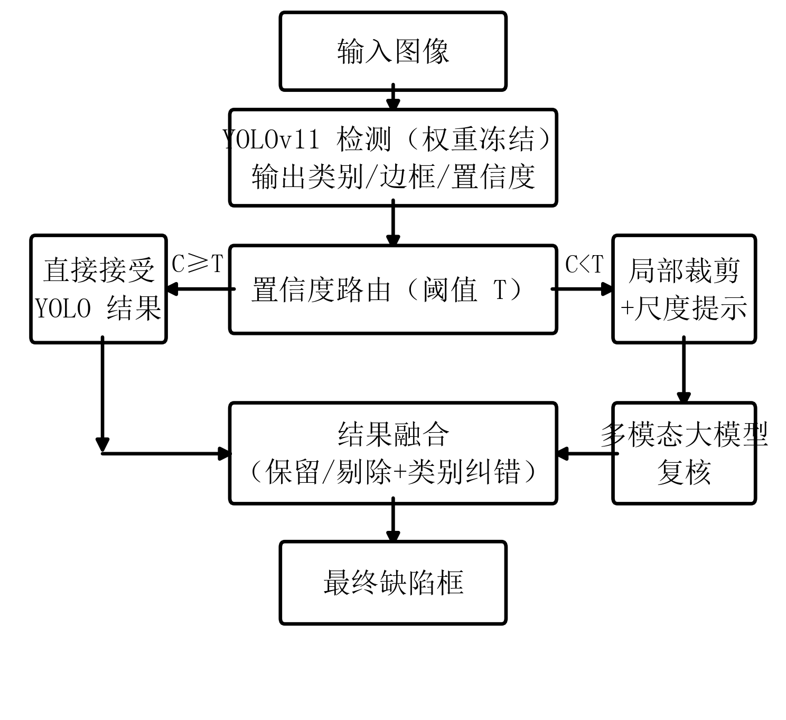
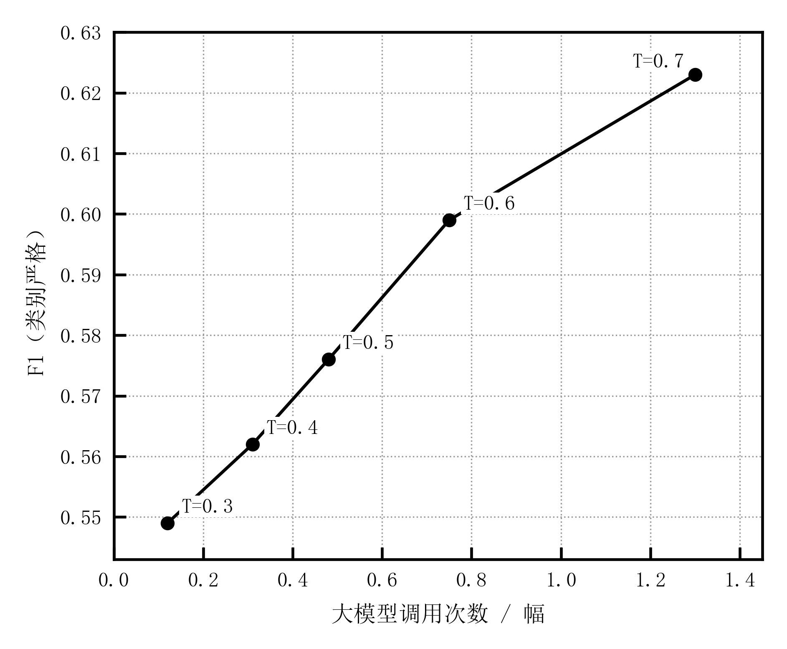
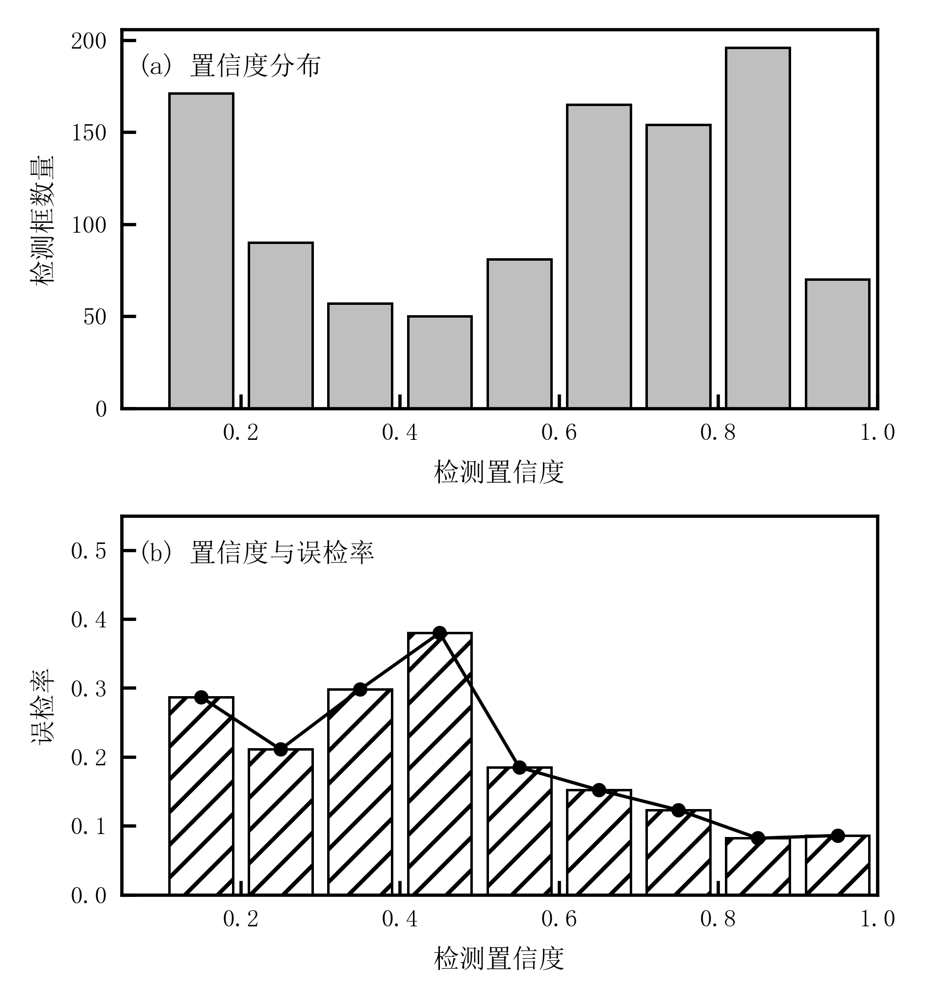
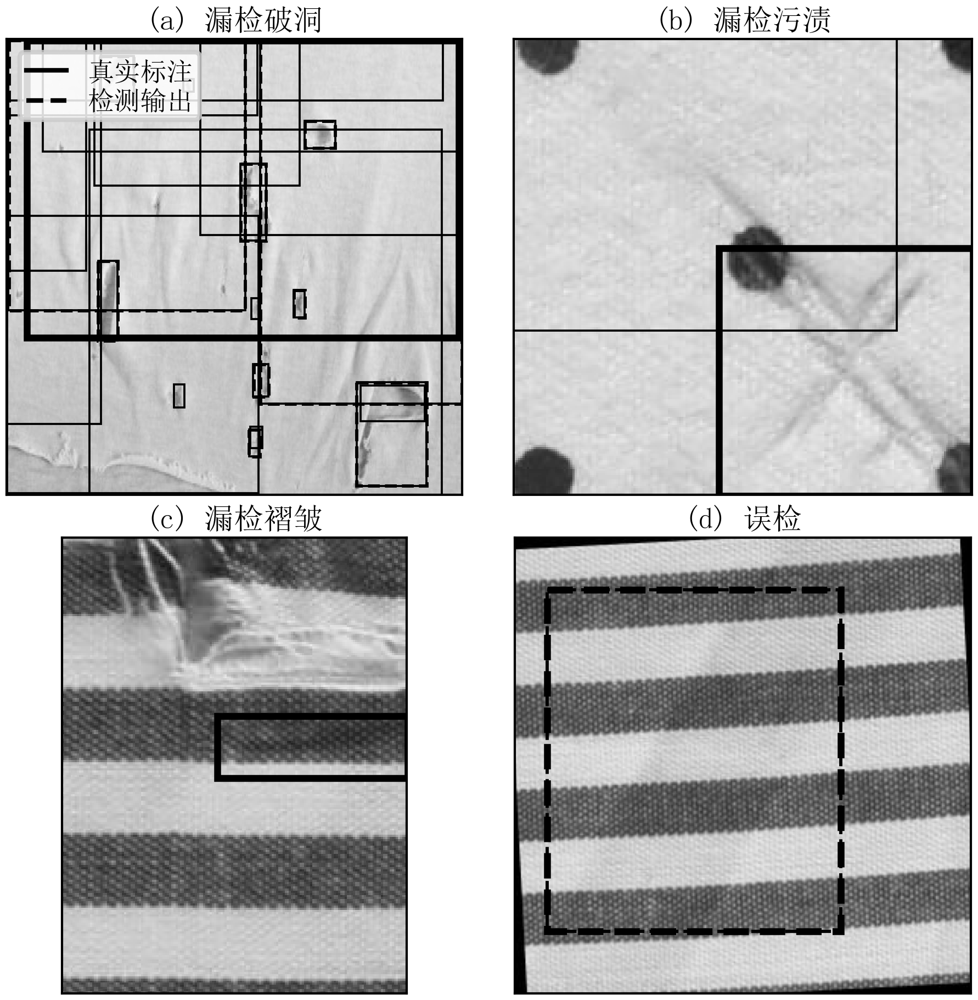

# 服装微痕检测的视觉与大模型协同推理方法

**杨骏杰**

（武汉工程大学 计算机科学与工程学院，武汉 430205）

E-mail：1719369817@qq.com

**摘要**：服装表面微痕检测中，专用目标检测模型定位精确，但在低对比度、微小尺度与纹理相似的疑难样本上漏检显著；多模态大模型语义判断能力强，却难以独立完成像素级精确定位。为此，提出一种视觉模型与多模态大模型协同推理方法。该方法以冻结的 YOLOv11 作为感知前端输出候选缺陷框，由置信度驱动的动态路由判定疑难度，仅将低置信度候选送入多模态大模型复核，并通过规则融合实现类别纠错与误检剔除。在经标注修正的 300 幅测试图像上，所提方法将框级 F1 由基线 0.515 提升至 0.599，大模型平均调用量仅 0.75 次/幅，并优于直接降低检测阈值的控制组（0.540），表明增益源于语义复核而非阈值下移。进一步实验表明：局部裁剪作为视觉证据可提升大模型复核准确率（0.643 对 0.598）；协同带来的召回增益集中于最难的褶皱类别（由 0.278 提升至 0.417）；阈值与调用成本呈明确的 Pareto 关系，为给定预算下配置协同策略提供依据。

**关键词**：服装缺陷检测；多模态大模型；置信度路由；协同推理；成本-性能权衡

**中图分类号**：TP391.4 **文献标志码**：A

---

**Collaborative inference between a vision model and a multimodal large model for garment micro-defect detection**

**YANG Junjie**

(School of Computer Science and Engineering, Wuhan Institute of Technology, Wuhan 430205, China)

E-mail: 1719369817@qq.com

**Abstract**: In garment surface micro-defect detection, specialized object detectors localize defects precisely but miss substantially on hard samples with low contrast, small scale and similar texture, while multimodal large language models (MLLMs) possess strong semantic judgement yet cannot perform pixel-level localization independently. This paper proposes a collaborative inference method between a vision detector and an MLLM. A frozen YOLOv11 serves as the perception front-end producing candidate defect boxes; a confidence-driven router determines difficulty and forwards only low-confidence candidates to the MLLM for verification; rule-based fusion then performs category correction and false-positive removal. On 300 test images with corrected annotations, the proposed method raises box-level F1 from 0.515 to 0.599 with only 0.75 MLLM calls per image on average, outperforming a control group that merely lowers the detection threshold (0.540), indicating that the gain stems from semantic verification rather than threshold shifting. Further experiments show that local crops as visual evidence improve MLLM verification accuracy (0.643 vs. 0.598), that the recall gain concentrates on the hardest class, wrinkles (0.278 to 0.417), and that threshold and call cost follow a clear Pareto relationship, providing a basis for configuring collaboration strategies under a given budget.

**Key words**: garment defect detection; multimodal large language model; confidence routing; collaborative inference; cost-performance trade-off

---

## 0 引言

服装表面的破洞、污渍与褶皱等瑕疵直接影响商品外观与质量判定。人工质检存在成本高、主观性强、一致性差的问题；基于深度学习的视觉检测方法已在工业与商品缺陷检测中广泛应用，其中以 YOLO 系列为代表的单阶段检测器因兼顾精度与速度而被大量部署[3-4]。在纺织与服装缺陷检测领域，已有研究围绕数据集构建、小目标增强与多尺度特征融合展开系统性探索[1-2]。

**检测模型在疑难样本上漏检显著。** 目标检测模型擅长边界框回归与快速推理，但对低对比度、微小尺度与纹理相似的缺陷容易出现漏检。小目标检测研究指出，此类目标在深层网络中特征响应弱、易被复杂背景淹没[5-7]。本文实测亦表明：在标注修正后的测试集上，基线模型框级召回仅为 0.475，其中褶皱类别低至 0.278。

**多模态大模型难以独立完成精确定位。** 多模态大模型在图像描述、视觉问答与区域理解方面表现突出，已被用于工业异常检测与缺陷分类[9-10]。但其训练目标为跨模态语义对齐而非像素级坐标回归，定位结果较粗；且在细粒度视觉概念识别上存在明显不足[8]。对全部样本无差别调用大模型还将显著增加推理成本与延迟。

两类模型的能力具有互补性：检测模型提供精确的边界框但召回不足，多模态大模型语义判断强但定位粗。据此，本文不追求"以大模型替代检测模型"，而研究何时值得调用大模型，以及如何协同完成最终判定。主要工作包括：

1. 构建服装表面微痕的"检测模型 + 多模态大模型"协同推理框架；
2. 设计以检测置信度为信号的动态路由机制，并引入局部裁剪与尺度提示作为复核证据；
3. 通过对比、阈值、消融与难样本实验验证协同推理的有效性，给出调用成本与检测性能之间的 Pareto 关系。

## 1 相关工作

### 1.1 目标检测与纺织/工业缺陷检测

单阶段检测器将检测统一为回归问题，实现了实时推理[3]，其后续版本在骨干网络、特征融合与训练策略上持续演进[4]。检测器设计中普遍存在精度与速度的权衡[11]，级联结构则通过逐级剔除简单样本，把计算集中在困难区域[12]，这一思想构成了本文"按置信度决定是否调用重模型"的方法渊源。

在纺织与工业表面缺陷检测方面，两阶段检测器的改进被用于提升小缺陷定位能力[13]；针对织物缺陷纹理相似、类间差异小的特点，空间注意力与多尺度特征融合被引入缺陷分类[14]；部分工作采用两阶段深度迁移学习缓解样本不足与类别不均衡[15]。面向具体工业场景，研究者分别针对铝型材[16]、金属齿轮[17]、绝缘子[18]、光伏电池[19-20]与电池包焊接[21]等对象提出改进检测方法。在通用技术上，深层多尺度特征融合[22]、双向特征金字塔[23]、注意力轻量化[24]与频域重标定[25]被用于增强多尺度特征表达。边缘检测[26]、去噪与语义增强[27]、梯度增强[28]等预处理与增强手段，亦被证明有助于提升低信噪比条件下的目标可检测性。相关综述进一步总结了复杂背景下目标检测的挑战与方法脉络[29-30]。

上述工作主要通过改进检测器结构或训练策略来提升性能，其能力上限受训练标注质量与类别难度分布制约。本文则保持检测器权重不变，在系统层面引入大模型协同。

### 1.2 多模态大模型的视觉理解

工业异常检测领域已建立包含多类材质与像素级标注的基准数据集，成为方法评测的通用平台[31]。在无缺陷标注条件下，自监督学习被用于表面异常检测与定位[32]。随着视觉语言模型的发展，文本对齐的异常检测主干可将语言先验注入检测特征[33]，视觉-语言融合结合合成数据的方法被用于跨场景异常检测[34]，自适应多模态大模型亦被用于工业零件表面缺陷检测[35]。在制造过程中，多模态大模型已被验证可用于缺陷检测[36]。多模态视觉理解大模型的进展综述进一步梳理了其能力边界与典型应用[9]。上述研究同时指出，此类模型在细粒度局部纹理差异的判别上受输入分辨率与提示设计影响明显[8]。

### 1.3 视觉模型与大模型协同推理

协同推理的常见形式是"专家模型负责感知、大模型负责语义推理"。在工业检测中，大型视觉语言模型被用于航空器检测并引入人工在回路[37]，多视角视觉-语言交互被用于缺陷与篡改的检测与定位[40]。与之相关的方法论包括：级联推理以低成本模型快速筛除简单样本[12]；"学习延迟"机制将不确定样本交由更强决策者处理并显式建模不确定性[38]；选择性分类通过不确定性估计允许模型弃权，从而降低高风险误判[39]。这些研究共同表明，以置信度或不确定性作为"是否转交"的信号具有理论合理性。

本文关注的问题与之衔接但侧重不同：在成本约束下，如何以检测置信度为信号分配大模型的复核资源，并量化由此获得的可靠性提升。

## 2 方法

### 2.1 整体框架

所提方法的整体框架如图 1 所示。输入图像先经检测模型产生候选框及其置信度；置信度路由依据阈值决定候选框直接接受或转交多模态大模型复核；复核结果与检测结果融合后输出最终缺陷框。



### 2.2 检测模块

检测模块采用 YOLOv11s 模型，输入尺寸 640×640，训练策略与超参数沿用既有部署模型（迁移学习、约 200 轮、批大小 16、初始学习率 0.001）。本文不对该模型进行重训练，其权重在协同推理过程中保持冻结，以反映真实部署条件下的改进路径。

### 2.3 置信度驱动的动态路由

对每个检测框的置信度设定路由阈值 T：置信度不低于 T 的检测框直接接受，低于 T 的检测框转交多模态大模型复核。阈值 T 为唯一路由信号，其合理性依赖"置信度与检测质量正相关"这一前提，该前提在第 3.6 节通过置信度-错误率曲线验证。路由机制的设计动机与级联推理[12]、学习延迟[38]及选择性分类[39]的思想一致。

实际推理时将检测置信度阈值设为 0.25 以获得较完整的候选集合，路由阈值 T 依据成本预算确定。

### 2.4 局部区域提取与尺度提示

对被路由的候选框，按边界外扩 30% 裁剪；若裁剪区域较小则放大至不小于 96 像素。为缓解模型对"放大后局部图"的尺度误判，在提示词中显式给出尺度信息：原图尺寸、裁剪图尺寸以及候选框占原图的面积比例。该设计借鉴了图像增强有助于提升弱小目标可检测性的结论[26-28]。

### 2.5 多模态大模型复核

复核模型为 qwen3-vl-plus，输出结构化结果：

```json
{"is_defect": true, "category": "hole|stain|wrinkle", "confidence": 0.0~1.0, "reason": "..."}
```

提示词明确质检场景语义（褶皱与折痕属于瑕疵），并要求仅输出 JSON。大模型在细粒度视觉识别上存在固有局限[8]，因此其在本框架中承担语义复核与类别纠错职责，而非替代检测模型的定位功能。

### 2.6 结果融合

融合规则如下：置信度不低于阈值的检测框直接保留；被路由的检测框若复核判定为缺陷则保留、否则剔除；保留时类别以复核结果为准（类别纠错），边界框沿用检测模型的精确定位。

## 3 实验

### 3.1 数据集与评测口径

**数据集与数据来源**：所用图像均为公开数据，来源于天池布匹瑕疵检测竞赛数据集与 Roboflow 平台公开的纺织/服装缺陷数据集（含破洞、污渍、褶皱三类子集，其中褶皱子集采用 CC BY 4.0 许可），两类数据均允许用于学术研究与论文发表，不存在许可冲突。在此基础上构建训练集 2155 幅、验证集 271 幅、测试集 300 幅，三者按图像内容去重后完全隔离。原始公开数据存在标注漏标与错标问题，本文对验证集与测试集进行了"大模型预筛 + 人工逐框确认"的重新标注；测试集修正后包含 849 个缺陷框（破洞 372、污渍 132、褶皱 345）。

**评测口径**：框级匹配采用 IoU=0.5；以类别严格（检测框类别与真值一致）为主指标，类别无关（仅判断是否命中真实缺陷位置）为辅助指标；另报告图像级（图像有无缺陷）F1。检测模型单独评测时置信度阈值取 0.4。

### 3.2 基线模型

基线模型的性能如表 1 所示。检测模型在类别严格口径下 F1 为 0.515，召回明显低于精确率；多模态大模型整图独立判断在图像级口径下 F1 达 0.9315，说明其语义判断能力较强。

**表1 基线模型性能<br>Table 1 Performance of the baseline models**

| 项 | 数值 |
|---|---|
| 检测模型（置信度 0.4，类别严格） | P 0.563 / R 0.475 / F1 0.515 |
| 检测模型 mAP50 | 0.387 |
| 检测模型图像级 F1 | 0.908 |
| 多模态大模型整图独立判断（图像级） | P 0.943 / R 0.920 / F1 0.9315 |

### 3.3 协同推理对比实验

表 2 给出各方法的对比结果。本文方法（T=0.60）将严格口径 F1 由 0.515 提升至 0.599，精确率与召回率同时提升；相较直接降低检测阈值的控制组（0.540），本文方法提升至 0.599，说明增益来自语义复核而非阈值下移；全复核配置取得最高 F1（0.755），但需 2.70 次调用/幅，代价显著。

**表2 协同推理对比实验<br>Table 2 Comparison of collaborative inference methods**

| 方法 | P(严格) | R(严格) | F1(严格) | F1(无关) | 图像级F1 | 调用/幅 |
|---|---:|---:|---:|---:|---:|---:|
| 检测模型（基线，置信度 0.4） | 0.563 | 0.475 | 0.515 | 0.787 | 0.908 | 0 |
| 低阈值控制组（置信度 0.25） | 0.553 | 0.528 | 0.540 | 0.826 | 0.907 | 0 |
| 全复核（逐框裁剪复核） | **0.815** | **0.703** | **0.755** | **0.858** | **0.954** | 2.70 |
| 本文方法（T=0.60） | 0.627 | 0.572 | **0.599** | 0.845 | 0.923 | **0.75** |
| 本文方法（T=0.70） | 0.660 | 0.590 | 0.623 | 0.846 | 0.924 | 1.30 |

### 3.4 阈值与成本-性能关系

路由阈值与调用成本、检测性能的关系如表 3 所示，对应的 Pareto 曲线见图 2。边际收益在 T=0.60 处最高，其后明显下降，故取 T=0.60 为默认操作点；T=0.70 适用于更高精度需求。这一权衡关系与检测器设计中精度-速度权衡的研究范式一致[11]。

**表3 不同路由阈值下的调用成本与检测性能<br>Table 3 Call cost and detection performance under different routing thresholds**

| T | 0.30 | 0.40 | 0.50 | **0.60** | 0.70 |
|---|---:|---:|---:|---:|---:|
| 调用/幅 | 0.12 | 0.31 | 0.48 | **0.75** | 1.30 |
| F1(严格) | 0.549 | 0.562 | 0.576 | **0.599** | 0.623 |
| 边际收益（F1/次调用） | 0.068 | 0.082 | 0.085 | **0.085** | 0.044 |



### 3.5 消融实验

消融实验结果如表 4 所示。局部裁剪显著提升复核效果（方案 B 为 0.755，方案 C 为 0.550）；动态路由在性能与调用成本之间提供可调权衡。

**表4 消融实验<br>Table 4 Ablation study**

| 方案 | 检测 | 裁剪 | 大模型复核 | 动态路由 | F1(严格) | F1(无关) |
|---|:--:|:--:|:--:|:--:|---:|---:|
| A | ✓ | | | | 0.515 | 0.787 |
| B | ✓ | ✓ | ✓ | | **0.755** | **0.858** |
| C | ✓ | | ✓（整图） | | 0.550 | 0.830 |
| D（本文） | ✓ | ✓ | ✓ | ✓ | 0.599 | 0.845 |

### 3.6 置信度有效性与局部证据验证

置信度与错误率的关系如图 3 所示：置信度低于 0.5 的检测平均错误率约 25%，不低于 0.6 的约 12%，且在 0.6~0.9 区间单调下降。该结果支持以置信度作为路由信号的前提假设。



对同一批 810 个检测框，仅改变大模型输入形式，结果如表 5 所示。裁剪图带来的提升主要体现在拒绝假缺陷（真负例 75 对 39），召回基本不变。

**表5 大模型输入形式对复核效果的影响<br>Table 5 Effect of MLLM input form on verification**

| 大模型输入 | 准确率 | 精确率 | 召回率 | F1 |
|---|---:|---:|---:|---:|
| 裁剪图（含尺度提示） | **0.643** | **0.609** | 0.996 | **0.755** |
| 整图 | 0.598 | 0.579 | 0.993 | 0.732 |

按类别统计的召回率如表 6 所示。褶皱为最难类别（基线召回 0.278），协同方法在该类别上的提升最大（由 0.278 提升至 0.417），高于破洞（+0.086）与污渍（+0.023），表明增益主要来自疑难样本。

**表6 不同缺陷类别的召回率<br>Table 6 Recall of different defect categories**

| 方法 | 破洞 | 污渍 | 褶皱 |
|---|---:|---:|---:|
| 检测模型（置信度 0.4） | 0.605 | 0.621 | **0.278** |
| 低阈值控制组（置信度 0.25） | 0.699 | 0.629 | 0.304 |
| 本文方法（T=0.60） | 0.691 | 0.644 | **0.417** |

以"缺陷面积小、对比度低"等客观属性划分的难样本子集（495 框）与类别存在混淆（面积较大的框多为褶皱），其召回（0.531~0.608）不低于相应的"简单"子集（0.396~0.523）。因此本文以类别而非面积或对比度作为难度判据。

### 3.7 案例分析

典型错误案例见图 4。协同机制主要修正低置信度区域的误检与类别错误，并使部分被漏检的缺陷得到找回；对于极端模糊或标注边界不清的样本，仍存在误判情形。



### 3.8 效率分析

各环节的推理耗时如表 7 所示。检测模型的推理开销可忽略，端到端延迟主要由大模型调用次数决定，动态路由即为控制该开销的核心手段。

**表7 推理效率<br>Table 7 Inference efficiency**

| 项 | 数值 |
|---|---|
| 检测模型单幅推理 | 约 0.027 s |
| 大模型单次复核 | 约 1.82 s |
| 本文方法平均调用 | 0.75 次/幅 |
| 本文方法平均大模型耗时 | 约 1.37 s/幅 |

## 4 结论

针对服装表面微痕检测中"检测模型定位准但漏检多、多模态大模型判断强但定位粗"的能力互补性，本文提出置信度驱动的协同推理方法。在经标注修正的测试集上，方法将框级 F1 由 0.515 提升至 0.599，仅需 0.75 次大模型调用/幅，并优于低阈值控制组；实验进一步表明局部裁剪可提升复核准确率，且召回增益集中于最难的褶皱类别。

本文方法存在以下局限：路由未对高置信度检测框进行类别复核，整体性能低于全复核上限；以面积与对比度定义的难样本与类别存在混淆，难度建模有待改进；实验仅覆盖三类缺陷与有限面料类型，方法的泛化性仍需在更大规模数据上验证。

后续工作可从三个方向展开：引入轻量图文对齐模型（如 CLIP、SigLIP）作为检测与大模型之间的低成本中间层，研究多级协同的计算分配；以置信度校准与风险分级提升决策可信性；借助大模型辅助的标注修正流程改进训练数据质量，进而提升检测模型的能力上限。

## 参考文献

[1] KAHRAMAN Y, DURMUŞOĞLU A. Deep learning-based fabric defect detection: a review[J]. Textile Research Journal, 2023, 93(5/6): 1485-1503.

[2] NASIM M Q, MUMTAZ R, AHMAD M, et al. Fabric defect detection in real world manufacturing using deep learning[J]. Information, 2024, 15(8): 476.

[3] REDMON J, DIVVALA S, GIRSHICK R, et al. You only look once: unified, real-time object detection[C]//Proceedings of the 2016 IEEE Conference on Computer Vision and Pattern Recognition, Las Vegas: IEEE, 2016: 779-788.

[4] DIWAN T, ANIRUDH G, TEMBHURNE J V. Object detection using YOLO: challenges, architectural successors, datasets and applications[J]. Multimedia Tools and Applications, 2023, 82(6): 9243-9275.

[5] 高广帅, 商云起, 董燕, 等. 光学遥感图像小目标检测深度学习算法综述[J]. 中国图象图形学报, 2025, 30(11): 3479-3505.<br>GAO G S, SHANG Y Q, DONG Y, et al. Review of deep learning algorithms for small object detection in optical remote sensing images[J]. Journal of Image and Graphics, 2025, 30(11): 3479-3505.

[6] 单慧琳, 王硕洋, 童俊毅, 等. 增强小目标特征的多尺度光学遥感图像目标检测[J]. 光学学报, 2024, 44(6): 0628006.<br>SHAN H L, WANG S Y, TONG J Y, et al. Multi-scale optical remote sensing image target detection based on enhanced small target features[J]. Acta Optica Sinica, 2024, 44(6): 0628006.

[7] PATIL R S, PATIL S R. Optimizing lightweight deep learning for realtime fabric defect detection with multi-scale and small defect focus[C]//Proceedings of the 2025 IEEE 4th International Conference for Advancement in Technology, Goa: IEEE, 2025: 1-5.

[8] KIM J, JI H. Finer: investigating and enhancing fine-grained visual concept recognition in large vision language models[C]//Proceedings of the 2024 Conference on Empirical Methods in Natural Language Processing, Miami: Association for Computational Linguistics, 2024: 6187-6207.

[9] 于雅婷, 曹聪琦, 王兆英, 等. 面向无人机的多模态视觉理解大模型研究进展[J/OL]. 中国图象图形学报, 2026[2026-09-24]. https://doi.org/10.11834/jig.260215.<br>YU Y T, CAO C Q, WANG Z Y, et al. Recent advances in large multimodal models for UAV visual understanding[J/OL]. Journal of Image and Graphics, 2026[2026-09-24]. https://doi.org/10.11834/jig.260215.

[10] DING Y. Die-to-prompt: visual language model-based defect inspection and anomaly detection[C]//Proceedings of SPIE: Metrology, Inspection, and Process Control XXXIX, San Jose: SPIE, 2025: 82.

[11] HUANG J, RATHOD V, SUN C, et al. Speed/accuracy trade-offs for modern convolutional object detectors[C]//Proceedings of the 2017 IEEE Conference on Computer Vision and Pattern Recognition, Honolulu: IEEE, 2017: 3296-3297.

[12] VIOLA P, JONES M. Rapid object detection using a boosted cascade of simple features[C]//Proceedings of the 2001 IEEE Computer Society Conference on Computer Vision and Pattern Recognition, Kauai: IEEE, 2001: 511-518.

[13] AN M, WANG S, ZHENG L, et al. Fabric defect detection using deep learning: an improved Faster R-CNN approach[C]//Proceedings of the 2020 International Conference on Computer Vision, Image and Deep Learning, Chongqing: IEEE, 2020: 319-324.

[14] 宋智勇, 潘海鹏. 基于空间注意力多尺度特征融合的织物缺陷分类算法[J]. 激光与光电子学进展, 2022, 59(10): 1010005.<br>SONG Z Y, PAN H P. Fabric defect classification algorithm based on multi-scale feature fusion of spatial attention[J]. Laser & Optoelectronics Progress, 2022, 59(10): 1010005.

[15] 赵树煊, 张洁, 汪俊亮, 等. 基于两阶段深度迁移学习的面料疵点检测算法[J]. 机械工程学报, 2021, 57(17): 86-97.<br>ZHAO S X, ZHANG J, WANG J L, et al. Fabric defect detection algorithm based on two-stage deep transfer learning[J]. Journal of Mechanical Engineering, 2021, 57(17): 86-97.

[16] 刘向淋, 蔡嘉丽, 李春艳. 基于PFWT-YOLOv8n的铝型材表面瑕疵检测[J]. 激光与光电子学进展, 2025, 62(22): 2215006.<br>LIU X L, CAI J L, LI C Y. Surface defect detection in aluminum profiles based on PFWT-YOLOv8n[J]. Laser & Optoelectronics Progress, 2025, 62(22): 2215006.

[17] 张曙文, 钟振宇, 朱大虎. 基于改进YOLOx网络的金属齿轮表面缺陷检测方法[J]. 激光与光电子学进展, 2023, 60(22): 2215005.<br>ZHANG S W, ZHONG Z Y, ZHU D H. Gear surface defect detection method based on improved YOLOx network[J]. Laser & Optoelectronics Progress, 2023, 60(22): 2215005.

[18] 孙铁强, 洪兆志, 宋超, 等. 基于多尺度特征融合的轻量化绝缘子缺陷检测[J]. 激光与光电子学进展, 2025, 62(6): 0612008.<br>SUN T Q, HONG Z Z, SONG C, et al. Lightweight insulator defect detection based on multiscale feature fusion[J]. Laser & Optoelectronics Progress, 2025, 62(6): 0612008.

[19] 谷瑞, 刘纯平, 沈婧. 融合多尺度特征与重参数化策略的光伏电池缺陷检测[J]. 激光与光电子学进展, 2026, 63(4): 0437009.<br>GU R, LIU C P, SHEN J. Defect detection of photovoltaic cells by integrating multi-scale features and reparameterization strategy[J]. Laser & Optoelectronics Progress, 2026, 63(4): 0437009.

[20] 卜迟武, 刘涛, 李锐, 等. 光伏电池缺陷红外热成像检测与图像序列处理[J]. 光学学报, 2022, 42(7): 0711002.<br>BU C W, LIU T, LI R, et al. Infrared thermography detection and images sequence processing for defects in photovoltaic cells[J]. Acta Optica Sinica, 2022, 42(7): 0711002.

[21] 吴桐, 杨金成, 廖瑞颖, 等. 基于线阵图像深度学习的电池组焊缝瑕疵检测[J]. 激光与光电子学进展, 2020, 57(22): 221502.<br>WU T, YANG J C, LIAO R Y, et al. Weld defect inspection of battery pack based on deep learning of linear array image[J]. Laser & Optoelectronics Progress, 2020, 57(22): 221502.

[22] 刘鑫, 陈思溢, 陈小龙, 等. 基于深度学习的深层次多尺度特征融合目标检测算法[J]. 激光与光电子学进展, 2021, 58(12): 1210029.<br>LIU X, CHEN S Y, CHEN X L, et al. Deep multi-scale feature fusion target detection algorithm based on deep learning[J]. Laser & Optoelectronics Progress, 2021, 58(12): 1210029.

[23] 张云川, 姜麟, 林莉. 基于单次双向特征金字塔网络的目标检测模型[J]. 激光与光电子学进展, 2023, 60(2): 0215005.<br>ZHANG Y C, JIANG L, LIN L. Target detection model based on once bidirectional feature pyramid network[J]. Laser & Optoelectronics Progress, 2023, 60(2): 0215005.

[24] 金梅, 李义辉, 张立国, 等. 基于注意力机制改进的轻量级目标检测算法[J]. 激光与光电子学进展, 2023, 60(4): 0415008.<br>JIN M, LI Y H, ZHANG L G, et al. Attention mechanism-based improved lightweight target detection algorithm[J]. Laser & Optoelectronics Progress, 2023, 60(4): 0415008.

[25] 沈学利, 李东峰. 频域重标定与自适应稀疏金字塔水下实时目标检测[J]. 激光与光电子学进展, 2026, 63(12): 1215009.<br>SHEN X L, LI D F. Real-time underwater object detection with frequency-domain recalibration and adaptive sparse pyramid[J]. Laser & Optoelectronics Progress, 2026, 63(12): 1215009.

[26] 刘世凯, 周志远, 史保森. 光学图像边缘检测技术研究进展[J]. 激光与光电子学进展, 2021, 58(10): 1011014.<br>LIU S K, ZHOU Z Y, SHI B S. Progress on optical image edge detection[J]. Laser & Optoelectronics Progress, 2021, 58(10): 1011014.

[27] 曲海成, 申磊. 面向目标检测的SAR图像去噪和语义增强[J]. 光子学报, 2022, 51(4): 0410003.<br>QU H C, SHEN L. SAR image denoising and semantic enhancement for object detection[J]. Acta Photonica Sinica, 2022, 51(4): 0410003.

[28] 楼晨风, 张湧, 刘亚. 基于互补梯度增强的红外线列扫描图像小目标检测[J]. 光学学报, 2021, 41(21): 2104001.<br>LOU C F, ZHANG Y, LIU Y. Small target detection of infrared linear array image based on complemented gradient enhancement[J]. Acta Optica Sinica, 2021, 41(21): 2104001.

[29] 侯笑晗, 金国栋, 谭力宁. 基于深度学习的SAR图像舰船目标检测综述[J]. 激光与光电子学进展, 2021, 58(4): 0400005.<br>HOU X H, JIN G D, TAN L N. Survey of ship detection in SAR images based on deep learning[J]. Laser & Optoelectronics Progress, 2021, 58(4): 0400005.

[30] 吴一全, 谢浩博. 基于深度学习的单目深度估计方法综述[J]. 光学学报（网络版）, 2025, 2(13): 1305001.<br>WU Y Q, XIE H B. A survey of monocular depth estimation methods based on deep learning[J]. Acta Optica Sinica (Online), 2025, 2(13): 1305001.

[31] BERGMANN P, FAUSER M, SATTLEGGER D, et al. MVTec AD: a comprehensive real-world dataset for unsupervised anomaly detection[C]//Proceedings of the 2019 IEEE/CVF Conference on Computer Vision and Pattern Recognition, Long Beach: IEEE, 2019: 9584-9592.

[32] LI C L, SOHN K, YOON J, et al. CutPaste: self-supervised learning for anomaly detection and localization[C]//Proceedings of the 2021 IEEE/CVF Conference on Computer Vision and Pattern Recognition, Nashville: IEEE, 2021: 9659-9669.

[33] LEE H W, LAI S H. TAB: text-align anomaly backbone model for industrial inspection tasks[C]//Proceedings of the 2024 IEEE/CVF Conference on Computer Vision and Pattern Recognition Workshops, Seattle: IEEE, 2024: 3921-3929.

[34] LI J, WEN S, KARIMI H R. Zoom-Anomaly: multimodal vision-language fusion industrial anomaly detection with synthetic data[J]. Information Fusion, 2026, 127: 103910.

[35] XI W, LI J. Adaptive multimodal large model for automated surface defect detection in industrial parts[C]//Proceedings of the 2025 3rd International Conference on Signal Processing and Intelligent Computing, Guangzhou: IEEE, 2025: 1-6.

[36] WU G, CHENG C T, PANG T Y. Defect detection in material extrusion with multimodal large language model[C]//Proceedings of the 2024 IEEE Asia Pacific Conference on Circuits and Systems, Taipei: IEEE, 2024.

[37] HA S, LERCEL D, NANDA G. Large vision language models for anomaly detection in aircraft inspection with inspectors in the loop[C]//AIAA AVIATION FORUM AND ASCEND 2025, Las Vegas: AIAA, 2025.

[38] LIU J, GALLEGO B, BARBIERI S. Incorporating uncertainty in learning to defer algorithms for safe computer-aided diagnosis[J]. Scientific Reports, 2022, 12(1): 1762.

[39] GARCIA J J, KITZMILLER R, KRISHNAMURTHY A, et al. Selective classification with machine learning uncertainty estimates improves ACS prediction: a retrospective study in the prehospital setting[J]. Scientific Reports, 2026, 16(1): 913.

[40] 刘凤阳, 张玉金, 吴飞. 多视角视觉—语言交互的多模态媒体内容篡改检测与定位[J]. 中国图象图形学报, 2026, 31(4): 1090-1107.<br>LIU F Y, ZHANG Y J, WU F. Multiview vision-language interaction for multimodal media content manipulation detection and localization[J]. Journal of Image and Graphics, 2026, 31(4): 1090-1107.

## 联系方式

联系人：杨骏杰<br>通讯地址：武汉工程大学 计算机科学与工程学院（湖北省武汉市江夏区），邮政编码 430205<br>电子信箱：1719369817@qq.com；电话：17771031625
